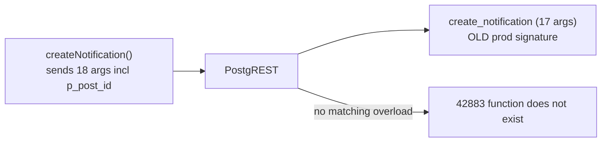

# EOD-HUB Notifications Audit

Status: live remediation applied 2026-05-25. The notifications pipeline was found to be silently broken on production (see "Root cause discovered after audit" below); two missing migrations were applied to project `bousixwneuwvirkmjbqq` and the round-trip pipeline is verified working. The remaining items under "Gaps & follow-ups" are still deferred to a future implementation pass.

Goal: confirm EOD-HUB has a single, centralized notification system (modeled after large social apps) that powers every notification surface — likes, comments, replies, mentions, DMs, know/worked-with, group activity, events, admin approvals, beta/waitlist updates, bug reports — and that it is positioned for future email and push expansion without per-feature forks.

## Root cause discovered after audit (2026-05-25)

### Symptom
"Almost no notifications coming into the bell." Confirmed against prod: 0 rows created in the last 7 days, 0 in the last 24 hours, total 7 rows ever (newest 2026-04-10), so essentially every notification call site had been silently failing for ~6 weeks.

### Cause
Production database drift. `supabase/migrations/` had been committed to git but only a subset of files were ever applied to the live database (`supabase_migrations.schema_migrations` lists 10 entries vs. the 104 files in the repo). Specifically, [supabase/migrations/20260413100000_kangaroo_court_notifications.sql](../supabase/migrations/20260413100000_kangaroo_court_notifications.sql) — which redefines `public.create_notification` with an 18th `p_post_id uuid` argument — was never applied.

Meanwhile [app/lib/notificationsServer.ts](../app/lib/notificationsServer.ts) has been sending `p_post_id` on every call since that migration was committed. PostgREST could not resolve the overload and returned:

```text
ERROR: 42883: function public.create_notification(p_recipient_user_id => uuid,
  p_actor_user_id => uuid, p_type => unknown, p_message => unknown,
  p_post_id => uuid) does not exist
```

…on every call. The error propagated up through `/api/notify`, `createNotification`, every server route, and the `notify()` client wrappers, but never surfaced to the user — the bell just stayed empty. Reproduced live by calling the RPC directly on prod before the fix.



Secondary drift: [supabase/migrations/20260409140000_notifications_delete_own.sql](../supabase/migrations/20260409140000_notifications_delete_own.sql) (the `Users delete own notifications` DELETE policy) was also missing. Not currently blocking because the v2-on dismiss path uses `UPDATE archived_at`, but the migration set was incomplete.

### Fix applied
Two migrations applied to prod via the Supabase MCP `apply_migration` tool (so the history table records them and prod/local stay aligned going forward):

1. **`kangaroo_court_notifications`** (corrected copy of `supabase/migrations/20260413100000_kangaroo_court_notifications.sql`):
   - Dropped the 17-arg `public.create_notification`.
   - Created the 18-arg `public.create_notification(..., p_post_id uuid)` with the same self-notify guard, dedupe lookup against active rows, `group_key` defaulting, `security definer`, `set search_path = public`, and re-granted execute to `authenticated, service_role`.
   - Replaced `public.open_kangaroo_court_on_feed_post(uuid, text[], int)` and `public.close_expired_kangaroo_courts()` with versions that pass `p_post_id` for KC deep links.
   - Also fixed a pre-existing defect in the migration file: `close_expired_kangaroo_courts()` referenced an undeclared `v_recipient` variable in its verdict-notification loop. Added `v_recipient uuid;` to the `DECLARE` block (committed to the repo copy of the file as well).

2. **`notifications_delete_own`** (copy of `supabase/migrations/20260409140000_notifications_delete_own.sql`):
   - Added the `Users delete own notifications` DELETE policy with `user_id = auth.uid()`.

### Verification
All run against prod after the migrations applied:

- `pg_get_function_identity_arguments` on `public.create_notification` now returns the full 18-arg list ending in `..., p_metadata jsonb, p_post_id uuid`, with `prosecdef = true`.
- Round-trip probe: called `create_notification(p_recipient_user_id, p_actor_user_id, p_type := 'audit_probe', p_message := ..., p_dedupe_key := ..., p_post_id := null)` against two real `profiles.user_id` rows; one row was inserted, the legacy-sync trigger correctly populated both `user_id`/`recipient_user_id` and both `actor_id`/`actor_user_id`, `is_read = false`, `archived_at = null`, `group_key` defaulted to `notification:<uuid>`. The probe row was then deleted.
- An earlier probe with a random `p_post_id` tripped the `notifications_post_id_fkey` FK on `posts` — useful negative test: it proves the RPC body executed all the way to the `INSERT` (parameters bound, no PGRST mismatch).
- `pg_policy` confirms `Users delete own notifications` is present with `polcmd = 'd'` and `using (user_id = auth.uid())`.

No application code changes were required. All existing callers were already shaped for the 18-arg RPC; they simply start succeeding now.

### Operational follow-up
- Monitor the `public.notifications` row count over the next 24 hours to confirm normal traffic resumes. Expected behaviour: likes, comments, mentions, DMs, group activity, etc. start landing in the bell again immediately.
- The wider migration-history drift (~94 local migration files vs. 10 entries in `supabase_migrations.schema_migrations`) is outside the scope of this fix but worth a dedicated reconciliation pass — manually-applied migrations should be backfilled into `schema_migrations` so future `supabase db push`/CI flows know what is already on prod.

## 1. Architecture map

```mermaid
flowchart LR
  featureUI["Feature surfaces<br/>(feed, units, sidebar, profile,<br/>lemon lot, bug report, KC, vouch, flag)"]
  postNotifyJson["postNotifyJson()<br/>client helper"]
  apiNotify["POST /api/notify"]
  createNotification["createNotification()<br/>server helper"]
  rpc["public.create_notification<br/>SECURITY DEFINER RPC"]
  table[("public.notifications")]
  realtime["supabase_realtime publication"]
  bell["NavBar bell +<br/>NotificationCenter modal"]

  featureUI -- "client features" --> postNotifyJson --> apiNotify --> createNotification
  featureUI -- "server API routes" --> createNotification
  createNotification --> rpc --> table
  table --> realtime --> bell
```



Every feature reaches the table through one of two paths:

- Client UI → `postNotifyJson` ([app/lib/postNotifyClient.ts](../app/lib/postNotifyClient.ts)) → `POST /api/notify` ([app/api/notify/route.ts](../app/api/notify/route.ts)) → `createNotification` ([app/lib/notificationsServer.ts](../app/lib/notificationsServer.ts)).
- Server route / SQL function → `createNotification` (or the SQL RPC directly).

Both terminate in the same `public.create_notification` RPC and the same `public.notifications` table. There are no per-feature notification tables.

## 2. Single-table check

Confirmed. Only `public.notifications` exists for in-app notifications. The full list of migrations that build or touch it:

| Migration | Purpose |
| --- | --- |
| [supabase/migrations/20260409120000_notifications_columns_unit_hot.sql](../supabase/migrations/20260409120000_notifications_columns_unit_hot.sql) | Adds `type`, `actor_id`, `post_id`, `unit_id`, `unit_post_id`, `metadata`; unit "hot" engagement plumbing. |
| [supabase/migrations/20260409140000_notifications_delete_own.sql](../supabase/migrations/20260409140000_notifications_delete_own.sql) | DELETE RLS policy for self-rows (dismiss). |
| [supabase/migrations/20260410153000_notifications_centralized.sql](../supabase/migrations/20260410153000_notifications_centralized.sql) | Adds the v2 column set (`recipient_user_id`, `actor_user_id`, `category`, `entity_type`, `entity_id`, `parent_entity_type`, `parent_entity_id`, `link`, `group_key`, `dedupe_key`, `read_at`, `archived_at`), indexes, legacy sync trigger, first version of `create_notification`, and the SELECT/UPDATE/INSERT RLS policies. |
| [supabase/migrations/20260410180000_notifications_realtime_publication.sql](../supabase/migrations/20260410180000_notifications_realtime_publication.sql) | Adds the table to `supabase_realtime` for live bell updates. |
| [supabase/migrations/20260413100000_kangaroo_court_notifications.sql](../supabase/migrations/20260413100000_kangaroo_court_notifications.sql) | Extends `create_notification` with `p_post_id`; KC opened/verdict fan-out reuses the same RPC. |
| [supabase/migrations/20260426145000_notifications_delete_user_actor_sync.sql](../supabase/migrations/20260426145000_notifications_delete_user_actor_sync.sql) | Hardens the legacy/v2 column sync trigger across INSERT and UPDATE so deletes/edits on either side stay in sync. |
| [supabase/migrations/20260524140000_email_digest_notifications.sql](../supabase/migrations/20260524140000_email_digest_notifications.sql) | Adds `notification_preferences` and `digest_send_logs` (sibling tables for digest scheduling — they do not duplicate the notifications inbox). |

## 3. Schema vs. requested fields

The brief listed an ideal column set. Mapping that to the live table:

| Requested field | Actual column | Status |
| --- | --- | --- |
| `id` | `id` | Present. |
| `recipient_user_id` | `recipient_user_id` (FK `auth.users`, NOT NULL) | Present. Legacy `user_id` is also still populated and kept in sync by the `notifications_sync_legacy_columns` trigger. |
| `actor_user_id` | `actor_user_id` (FK `auth.users`, nullable) | Present. Legacy `actor_id` mirrored by trigger. |
| `type` | `type` | Present. Free-text discriminator (e.g. `feed_like`, `mention_post`, `unit_join_request`, `connection_request`, `kangaroo_court_verdict`). |
| `category` | `category` | Present. Coarse bucket (`social` / `group` / `message` / `jobs` / `system`). Defaulted by trigger when null. |
| `entity_type` | `entity_type` | Present (`post`, `unit_post`, `comment`, `thread`, `profile_connection`, `unit`, …). |
| `entity_id` | `entity_id` | Present (uuid). |
| `link` | `link` | Present. Server writes deep links here; client `getNotificationHref` falls back to type/metadata if absent. |
| `message` | `message` | Present. Human copy for the row. |
| `metadata` jsonb | `metadata` (`jsonb`, default `'{}'`) | Present. Used for `unit_slug`, `comment_id`, `feed`/`wall` flags, `conversation_id`, `court_id`, etc. |
| `group_key` | `group_key` | Present. Set by callers and defaulted by trigger / RPC. |
| `dedupe_key` | `dedupe_key` | Present. Backed by partial unique index `idx_notifications_recipient_dedupe_active` (active rows only) plus RPC short-circuit. |
| `is_read` | `is_read` (bool) | Present. |
| `read_at` | `read_at` | Present. Trigger keeps `is_read` and `read_at` consistent. |
| `emailed_at` | — | **Missing.** Digest send state lives only on `digest_send_logs`. See Gaps. |
| `archived_at` | `archived_at` | Present. Dismiss writes archive + read timestamps. |
| `created_at` | `created_at` | Present. |

Additional fields beyond the brief that the table carries today: `actor_name`, `post_owner_id`, `parent_entity_type`, `parent_entity_id`, `post_id`, `unit_id`, `unit_post_id`. These are partially legacy (the typed FKs predate the v2 `entity_*` columns) but are still read by the UI and the nav helper, so they remain useful.

Indexes worth noting from [supabase/migrations/20260410153000_notifications_centralized.sql](../supabase/migrations/20260410153000_notifications_centralized.sql):

- `idx_notifications_recipient_created` (recipient + created_at desc)
- `idx_notifications_recipient_active` (recipient + archived_at + read_at + created_at)
- `idx_notifications_unread_partial` (partial: archived_at IS NULL AND read_at IS NULL) — drives the unread badge.
- `idx_notifications_recipient_dedupe_active` (unique partial on `(recipient_user_id, dedupe_key)` where `archived_at IS NULL` and `dedupe_key IS NOT NULL`) — backs `dedupe_key` semantics.

## 4. Reusable creation helper

There is one canonical helper. All call sites use it.

### Server helper

[app/lib/notificationsServer.ts](../app/lib/notificationsServer.ts):

```typescript
export async function createNotification(
  db: SupabaseClient,
  input: CreateNotificationInput,
): Promise<void> {
  const { error } = await db.rpc("create_notification", {
    p_recipient_user_id: input.recipientUserId,
    p_actor_user_id: input.actorUserId ?? null,
    // ... maps every field one-to-one onto the SQL RPC
  });
  if (error) throw error;
}
```

### SQL RPC

The current definition lives in [supabase/migrations/20260413100000_kangaroo_court_notifications.sql](../supabase/migrations/20260413100000_kangaroo_court_notifications.sql) (it supersedes the first version from the centralized migration). It is `SECURITY DEFINER`, `set search_path = public`, granted to `authenticated` and `service_role`.

The RPC implements every requirement from the brief:

- **Prevents self-notifications.** Early return when `p_actor_user_id = p_recipient_user_id`:

  ```sql
  if p_actor_user_id is not null and p_actor_user_id = p_recipient_user_id then
    select * into v_row from public.notifications where false;
    return v_row;
  end if;
  ```

- **Dedupes by `dedupe_key`.** Active row lookup before insert:

  ```sql
  if p_dedupe_key is not null then
    select *
    into v_row
    from public.notifications n
    where n.recipient_user_id = p_recipient_user_id
      and n.dedupe_key = p_dedupe_key
      and n.archived_at is null
    order by n.created_at desc
    limit 1;
    if found then return v_row; end if;
  end if;
  ```

  Backed by the unique partial index listed above so a race that bypasses the SELECT still trips a unique-violation.

- **Group key defaulting.** If the caller omits `p_group_key`, the RPC derives `post:<id>:<type>` (or a `notification:<id>` fallback). The legacy-sync trigger adds further defaults for unit posts, threads, and feed posts when rows are inserted directly.

- **Deep links.** `p_link` is stored verbatim. Callers across the codebase already write canonical hrefs (e.g. `/?postId=<id>&commentId=<id>`, `/units/<slug>?unitPostId=<id>`, `/profile/<id>`, `/sidebar`, `/admin`). The client falls back to [app/lib/notificationNavigation.ts](../app/lib/notificationNavigation.ts) `getNotificationHref` when the column is null, so older rows still navigate correctly.

- **Future email/push.** Per-row metadata is already JSONB and the RPC returns the inserted row, so a future hook can read `metadata`/`category`/`type` to decide whether to enqueue an email or push job. The missing `emailed_at` column is the only forward-compat gap (see Gaps).

## 5. RLS posture

Policies from [supabase/migrations/20260410153000_notifications_centralized.sql](../supabase/migrations/20260410153000_notifications_centralized.sql) and [supabase/migrations/20260409140000_notifications_delete_own.sql](../supabase/migrations/20260409140000_notifications_delete_own.sql):

| Operation | Policy | Allows |
| --- | --- | --- |
| SELECT | `Notifications select own recipient` | `recipient_user_id = auth.uid() OR user_id = auth.uid()` |
| UPDATE | `Notifications update own recipient` | Same predicate in `USING` and `WITH CHECK` (mark-read / archive). |
| INSERT | `Notifications insert own recipient` | `recipient_user_id = auth.uid() AND recipient_user_id = user_id` |
| DELETE | `Users delete own notifications` | `user_id = auth.uid()` |

Why this is safe:

- Clients cannot insert notifications for other users — the INSERT policy hard-binds the row to `auth.uid()`. Cross-user writes are only possible via the `SECURITY DEFINER` RPC, which itself enforces the no-self-notify and dedupe rules, and which is called from server code holding either a JWT (via `/api/notify`) or the service role.
- UPDATE requires a SELECT policy match in Postgres; both share the same predicate so mark-as-read/archive never silently no-ops.
- DELETE is scoped to the recipient (legacy `user_id` column, kept in sync with `recipient_user_id` by trigger).
- The trigger and RPC both run with `search_path = public`, mitigating search-path hijack risk.

Note: views are not used for notifications today, so the "views bypass RLS" trap is not relevant here.

## 6. Feature coverage matrix

Every feature called out in the brief already routes through the central pipeline. Specific call sites:

| Feature | Surface | Call site |
| --- | --- | --- |
| Feed post like | client | `notify()` in [app/(master)/page.tsx](../app/(master)/page.tsx) (debounced through [app/lib/likeNotifyDelay.ts](../app/lib/likeNotifyDelay.ts)); `type: "feed_like"` |
| Feed comment like | client | same `notify()` helper; `type: "feed_comment_like"` |
| Feed comment / reply | client | mention path in [app/(master)/page.tsx](../app/(master)/page.tsx); `type: "mention_comment"`, `type: "mention_post"` |
| Mentions in posts | client | [app/(master)/page.tsx](../app/(master)/page.tsx) mention block (`type: "mention_post"`) |
| Memorial mentions | client | [app/(master)/page.tsx](../app/(master)/page.tsx) memorial comment block (`type: "memorial_mention"`) |
| Profile wall posts / vouch | client + server | [app/(master)/profile/[userId]/page.tsx](../app/(master)/profile/%5BuserId%5D/page.tsx) `notify()` (`type: "wall_*"`); [app/api/profile-vouch/route.ts](../app/api/profile-vouch/route.ts) |
| Direct messages | client | [app/sidebar/page.tsx](../app/sidebar/page.tsx) — `type: "message_request"`, `type: "message_received"` |
| Know / Worked With | server | [app/api/profile-connections/action/route.ts](../app/api/profile-connections/action/route.ts) `notifyConnection()` (`type: "connection_request" / "connection_accepted" / "connection_denied" / "worked_with"`) |
| Group join request | server | [app/api/units/[slug]/join/route.ts](../app/api/units/%5Bslug%5D/join/route.ts) (`type: "unit_join_request"`) |
| Group join approval | server | [app/api/units/[slug]/admin/route.ts](../app/api/units/%5Bslug%5D/admin/route.ts) (`type: "unit_join_approval"`) |
| Group invite | server | [app/api/units/[slug]/invite/route.ts](../app/api/units/%5Bslug%5D/invite/route.ts) (`type: "unit_invite"`) |
| Group post like / comment | server | [app/api/units/[slug]/posts/[postId]/like/route.ts](../app/api/units/%5Bslug%5D/posts/%5BpostId%5D/like/route.ts) + [app/api/units/[slug]/posts/[postId]/comments/route.ts](../app/api/units/%5Bslug%5D/posts/%5BpostId%5D/comments/route.ts) |
| Group "hot post" fan-out | server | [app/lib/unitNotificationsServer.ts](../app/lib/unitNotificationsServer.ts) `maybeNotifyUnitHotEngagement` (`type: "unit_hot"`, threshold from [app/lib/notificationPolicy.ts](../app/lib/notificationPolicy.ts)) |
| Lemon Lot listing activity | client | [app/components/lemonLot/LemonLotMarketplaceView.tsx](../app/components/lemonLot/LemonLotMarketplaceView.tsx) |
| Kangaroo Court opened / verdict | SQL RPC | `open_kangaroo_court_on_feed_post`, `close_expired_kangaroo_courts` in [supabase/migrations/20260413100000_kangaroo_court_notifications.sql](../supabase/migrations/20260413100000_kangaroo_court_notifications.sql) |
| Flag content (author + admins) | server | [app/api/flag-content/route.ts](../app/api/flag-content/route.ts) |
| Bug reports | client | [app/components/bug-report/BugReportDialog.tsx](../app/components/bug-report/BugReportDialog.tsx) → raw `/api/notify` (see Gaps) |
| User account / beta approval | server | [app/lib/server/approveUserAccount.ts](../app/lib/server/approveUserAccount.ts) — email only today (see Gaps) |
| Events | client | Invite path in [app/events/page.tsx](../app/events/page.tsx) uses DMs, no first-class event notification type yet (see Gaps) |

Self-notify protection: every helper guards on `recipientId === actorId` either at the client (`notify` in feed/profile) or at the RPC layer.

Push/email future: no per-feature short-circuits — all rows live in one table with `type`, `category`, and `metadata`, so a future worker can scan the table without touching feature code.

## 7. UI surface

The user-facing surfaces are:

- **Bell + unread badge** — [app/components/NavBar.tsx](../app/components/NavBar.tsx). Selects `recipient_user_id = uid` and `archived_at IS NULL`, ordered by `created_at desc`, limit 100. Badge counts rows with `read_at IS NULL && archived_at IS NULL`.
- **NotificationCenter modal** — [app/components/NotificationCenter.tsx](../app/components/NotificationCenter.tsx). Renders as a portal modal (centered card, dark/light theme aware). Click → mark-read + deep link. Per-row dismiss → archive. "Mark all read" button updates everything unread for the current user.
- **Realtime updates** — `nav-live-<uid>` channel subscribes to all `notifications` changes filtered by `recipient_user_id`; refetches on any change.
- **Deep-link nav** — [app/lib/notificationNavigation.ts](../app/lib/notificationNavigation.ts) `getNotificationHref` resolves the right URL when `link` is null, covering unit join/approval/invite, KC, unit hot/like/comment, message requests, flags, job saves, memorials, connection requests, wall posts, feed mentions, and feed posts.
- **Grouping** — NotificationCenter collapses rows by `group_key`, showing the lead row and `+N more in this stack`. Multi-unread counts are summed per stack.
- **Email-prefs page** — `/account/notifications` ([app/account/notifications/page.tsx](../app/account/notifications/page.tsx)) is digest preferences, not an inbox. Per the audit scope, no separate full inbox page is being added.

Modern social-app copy is partially in place — strings live at the call site (e.g. `"${actorName} liked your post"`, `"${name} is requesting to join ${unit.name}"`, `"Your request to join ${unit.name} was approved"`, `"${actorName} marked that they know you."`) — but the dropdown does not yet aggregate by actor count when multiple rows share a `group_key` (see Gaps).

## 8. Realtime and deep links

- The publication is added by [supabase/migrations/20260410180000_notifications_realtime_publication.sql](../supabase/migrations/20260410180000_notifications_realtime_publication.sql).
- The NavBar subscription uses `postgres_changes` `event: "*"` so inserts (new notifications), updates (mark read, archive), and deletes (legacy dismiss) all refresh the local cache.
- Deep-link query params are honored by the feed and unit feed pages (`?postId=`, `?commentId=`, `?unitPostId=`) — see `app/globals.css` line 122 "Deep-link from notifications" pulse style for the soft-highlight on landing.

## 9. Gaps & follow-ups

These are deferred — flagging them so the next implementation pass has a checklist.

1. **Missing `emailed_at` column.** Add `emailed_at timestamptz null` to `public.notifications` for forward-compat with the future email/push worker. Today digest send state lives only on `digest_send_logs` (per-user/window, not per-notification). Even though email digest work is explicitly out of scope here, the column is cheap to add now and avoids a later schema-during-traffic migration. Pair with a partial index `(recipient_user_id, created_at)` `WHERE emailed_at IS NULL AND archived_at IS NULL` when the worker is built.

2. **Admin / beta approval has no in-app notification.** [app/lib/server/approveUserAccount.ts](../app/lib/server/approveUserAccount.ts) sends a Resend email but never calls `createNotification`. Recommend, after the profile update succeeds, calling:

   ```typescript
   await createNotification(adminClient, {
     recipientUserId: userId,
     actorName: "EOD HUB",
     type: "account_approved",
     category: "system",
     entityType: "profile",
     entityId: userId,
     message: "Your beta access was approved — welcome in.",
     link: `/profile/${userId}`,
     groupKey: `account:${userId}:approval`,
     dedupeKey: `account_approved:${userId}`,
     metadata: { source }, // 'admin' | 'vouch'
   });
   ```

   `dedupeKey` makes the call idempotent across the existing `wasAlreadyApproved` path.

3. **Bug report bypasses the typed helper.** [app/components/bug-report/BugReportDialog.tsx](../app/components/bug-report/BugReportDialog.tsx) line 96 calls `fetch("/api/notify")` directly with `type: "activity"` and no `category` / `group_key` / `dedupe_key`, so concurrent admin notifications can duplicate. Route through `postNotifyJson` with `type: "bug_report"`, `category: "system"`, `link: "/admin"`, `group_key: \`admin:bug_reports\``, `dedupe_key: \`bug_report:<reportId>:<adminId>\``.

4. **Legacy `NOTIFICATIONS_V2` flag is now dead branching.** [app/lib/notificationFlags.ts](../app/lib/notificationFlags.ts) defaults `NEXT_PUBLIC_NOTIFICATIONS_V2 !== "false"` to on, but [app/components/NavBar.tsx](../app/components/NavBar.tsx) still maintains a legacy `user_id = uid` query, a `.delete()`-based dismiss, an `openNotification` path that deletes rows, and a duplicate realtime filter. Recommend a follow-up pass that:
   - deletes `getNotificationsV2Enabled` / `FOUNDER_NOTIFICATIONS_V2_OVERRIDE_KEY` and the founder localStorage override;
   - simplifies `loadNotifications` to a single `.eq("recipient_user_id", uid).is("archived_at", null)` query;
   - keeps only the `archived_at = now()` dismiss path;
   - filters the realtime channel solely on `recipient_user_id`.

5. **No aggregated group copy.** When a `group_key` stack has multiple rows from different actors, the dropdown currently shows the lead row's `message` and `+N more in this stack`. To match the brief's "3 people liked your post" voice, compute aggregated copy in `NotificationCenter` from the grouped rows (no DB change required): track distinct `actor_id`s per stack, and for `type in {feed_like, unit_post_like, mention_post, …}` render `<lead> and <n − 1> others liked your post` when `n > 1`. The single-row copy at each call site already matches the modern style.

6. **Events lack a first-class notification type.** [app/events/page.tsx](../app/events/page.tsx) sends event invites through DMs rather than emitting `event_invite`/`event_updated`/`event_reminder` rows. Optional follow-up: add those types and route through `createNotification` with `entity_type: "event"`, then extend `getNotificationHref` to deep-link to `/events?event=<id>`.

7. **Naming clarity for `/account/notifications`.** Once item 4 lands and the modal is the only inbox, consider renaming `/account/notifications` to `/account/email-preferences` (or adding a clearer header) so users searching for "notifications" don't expect an inbox there. Per the audit scope, this is out of scope for this pass.

## 10. Summary

EOD-HUB already has the single, reusable notification architecture the brief describes:

- One table (`public.notifications`) with the requested column shape (minus `emailed_at`).
- One server helper (`createNotification` → `public.create_notification` RPC) that enforces no-self-notify, dedupe by `dedupe_key`, group_key defaulting, deep-link storage, and runs with `SECURITY DEFINER` plus least-privilege grants.
- One client wrapper (`postNotifyJson` → `/api/notify`) that injects the caller's JWT, prevents user_id spoofing, and retries on transient failures.
- RLS policies that let recipients read/update/delete their own rows and force cross-user writes through the security-definer RPC.
- A central NavBar bell + `NotificationCenter` modal with realtime updates, deep-link navigation, mark-all-read, and per-row archive — consistent with the existing dark UI and dashboard chrome.

The shipped surface is correct in shape. The seven follow-ups above are the deltas needed to fully match the brief's polish — none requires re-architecting; they are surgical edits to specific files.
