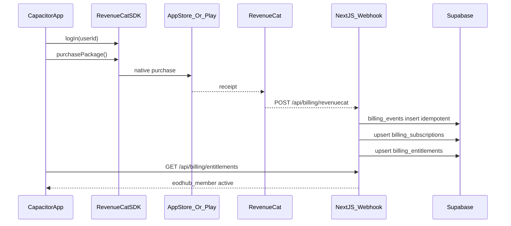
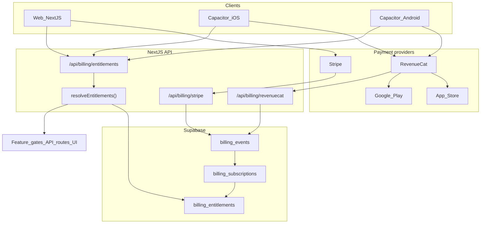

# EOD-Hub Subscription Architecture Review

Senior design review before implementation. **No code changes** — this refines the RevenueCat + Stripe proposal into a maintainable, store-compliant system.

---

## 1. Current state audit

### Stripe (web member subscriptions)

| Component | Location | Behavior |
|-----------|----------|----------|
| Checkout | [`app/api/stripe/checkout/route.ts`](app/api/stripe/checkout/route.ts) | Creates/reuses `stripe_customer_id` on profile; Stripe Checkout session with optional `trial_end` from `computeStripeTrialEndUnix()` |
| Portal | [`app/api/stripe/portal/route.ts`](app/api/stripe/portal/route.ts) | Billing management via Stripe Customer Portal |
| Webhook | [`app/api/stripe/webhook/route.ts`](app/api/stripe/webhook/route.ts) | Updates `profiles.subscription_status` by `stripe_customer_id` |
| Paywall kill-switch | [`app/lib/paywallWorkflow.ts`](app/lib/paywallWorkflow.ts) | `PAYWALL_SUSPENDED_UNTIL` (July 1, 2026) overrides env; `NEXT_PUBLIC_PAYWALL_ENFORCED` gates launch |

**Stripe webhook gaps (must fix in new architecture):**
- No idempotency (`event.id` not stored) — retries can cause redundant writes
- No event audit log
- Passes raw Stripe statuses (`past_due`, `canceled`, `cancelled`) without normalization
- Member vs business-org routing via metadata — correct pattern to preserve

### Stripe (business org — separate product)

| Component | Location |
|-----------|----------|
| Table | `business_organization_pages` — `subscription_status`, `stripe_customer_id`, `stripe_subscription_id` |
| Checkout/portal | [`app/api/stripe/business-org-checkout/route.ts`](app/api/stripe/business-org-checkout/route.ts), [`business-org-portal`](app/api/stripe/business-org-portal/route.ts) |
| Access helper | [`pageHasBillableAccess()`](app/lib/businessOrgPages.ts) |

**Important:** Business page billing is a **B2B page entitlement**, not a user membership. Keep it as a **separate billing subject** in the new model.

### Profile schema (member subscriptions)

**Critical finding:** Code reads/writes `profiles.subscription_status` and `profiles.stripe_customer_id` across 15+ files, but **no repo migration defines these columns on `profiles`** (only `subscription_terms_acknowledged_at` in [`20260404000000_subscription_terms_acknowledged_at.sql`](supabase/migrations/20260404000000_subscription_terms_acknowledged_at.sql)). This is **production schema drift** — formalize in migration before any billing refactor.

### Access control today

```mermaid
flowchart TB
  subgraph layers [Three independent gate layers]
    Auth["proxy.ts — session only"]
    Verify["hasFullPlatformAccess() — email + admin approval"]
    Sub["memberHasInteractionAccess() — trial + subscription_status"]
  end

  Auth --> Verify --> Sub --> Features
```



| Layer | Function | Where enforced |
|-------|----------|----------------|
| Authentication | [`proxy.ts`](proxy.ts) | All non-public routes — login only |
| Verification | [`hasFullPlatformAccess()`](app/lib/verificationAccess.ts) | [`useRequireFullAccess`](app/hooks/useRequireFullAccess.ts), MasterShell |
| Subscription | [`memberHasInteractionAccess()`](app/lib/subscriptionAccess.ts) | MasterShell redirect, `useMemberSubscriptionGate`, `getFeatureAccess`, **12 API routes** via [`assertMemberInteractionAllowed`](app/lib/memberSubscriptionServer.ts) |

**`resolveMemberSubscription()` does not exist.** All logic lives in `memberHasInteractionAccess()`, which **mixes three concerns:**
1. Role bypass (admin, employer)
2. Paid status (`subscription_status` in `active` / `trialing`)
3. Promotional calendar trial (June 2026 launch windows)

### Feature gating

[`getFeatureAccess()`](app/lib/featureAccess.ts) maps one boolean (`hasFullAccess`) to jobs, DMs, Rabbithole, business directory. **No tier differentiation** — fine for v1, blocks future `eodhub_senior` etc. without refactor.

Gating is **mostly client-side** (MasterShell redirect to `/subscribe`, modals). Server enforcement exists only on **units + vouch APIs** — not on feed posts, DMs, notifications. **Security gap:** determined users can bypass paywall via direct API calls until server gates expand.

### Arcade / tokens

Arcade is **not subscription-gated**. It uses founder-only preview + password cookie ([`app/lib/server/arcadeAccess.ts`](app/lib/server/arcadeAccess.ts)). No token economy exists yet.

**Architectural implication:** Future arcade token bundles are **consumables**, not subscriptions. They need a separate `user_credits` / `consumable_grants` path — do not fold into `eodhub_member`.

### Native app billing (in flight)

[`app/subscribe/page.tsx`](app/subscribe/page.tsx) opens Stripe in Safari via `@capacitor/browser` on native — **short-term only**, not store-compliant long-term for digital membership upgrades initiated in-app.

---

## 2. Recommended unified entitlement model

### Principle

The application checks **entitlement keys**, never providers.

```
hasEntitlement(user, 'eodhub_member')  → true/false
```

Providers (Apple, Google, Stripe, future) only **write** entitlement state via webhooks.

### Entitlement registry (versioned in code)

| Key | Meaning | v1 |
|-----|---------|-----|
| `eodhub_member` | Full member interaction access (current paywall) | Yes |
| `eodhub_senior` | Future tier | No |
| `eodhub_master` | Future tier | No |
| `eodhub_legendary` | Future tier | No |
| `eodhub_business` | Future B2B user tier (distinct from org pages) | No |

### Access precedence (resolver rules)

Evaluate in order; first match wins for **role overrides**, then **union of active entitlements**, then **promotional access**:

1. **Platform roles** (not entitlements): `is_admin`, `employer`, `business_org`, `is_pure_admin`
2. **Paywall suspended** ([`isPaywallSuspended()`](app/lib/paywallWorkflow.ts)): everyone gets member access
3. **Active DB entitlements** where `status = active` and (`expires_at` is null or `expires_at > now()`)
4. **Promotional trial** (computed calendar logic from existing `subscriptionAccess.ts` — do not duplicate in Stripe/RevenueCat for launch window)
5. Deny

Verification ([`hasFullPlatformAccess`](app/lib/verificationAccess.ts)) remains a **separate axis** — user can be verified but not subscribed.

### Proposed resolver API

```typescript
// app/lib/entitlements/resolveEntitlements.ts

type EntitlementKey = 'eodhub_member' | 'eodhub_senior' | ...;

type ResolvedAccess = {
  entitlements: Set<EntitlementKey>;
  sources: { key: EntitlementKey; provider: string; expiresAt: string | null }[];
  promotionalTrialActive: boolean;
  roles: { isAdmin: boolean; isEmployer: boolean; ... };
};

resolveEntitlements(userId, context?) → ResolvedAccess
hasEntitlement(resolved, 'eodhub_member') → boolean

// Back-compat shim (delete after migration):
memberHasInteractionAccess(input) → hasEntitlement(resolveFromLegacyInput(input), 'eodhub_member') || promotionalTrial...
```

---

## 3. Database schema (dedicated tables — not profiles)

### Why not profiles-only

- Multiple providers per user over lifetime (switched from Stripe → Apple)
- Multiple subscriptions (member + future tiers + consumables)
- Audit trail for App Store disputes
- Clean multi-subject billing (user vs business org page)

### Recommended tables

#### `billing_subscriptions`

One row per external subscription contract.

| Column | Type | Notes |
|--------|------|-------|
| `id` | uuid PK | |
| `subject_type` | text | `user` \| `business_org_page` |
| `subject_id` | uuid | `profiles.user_id` or `business_organization_pages.id` |
| `provider` | text | `stripe` \| `apple` \| `google` |
| `provider_customer_id` | text | Stripe cus_*, RC app_user_id, etc. |
| `provider_subscription_id` | text | sub_*, RC transaction id — **unique per provider** |
| `product_id` | text | `eodhub_member_monthly`, Stripe price id, store SKU |
| `status` | text | Normalized: `active`, `trialing`, `past_due`, `canceled`, `expired` |
| `entitlement_keys` | text[] | `['eodhub_member']` — supports multi-entitlement products later |
| `current_period_start` | timestamptz | |
| `current_period_end` | timestamptz | |
| `trial_end` | timestamptz | nullable |
| `canceled_at` | timestamptz | nullable |
| `last_verified_at` | timestamptz | Last webhook or reconciliation |
| `metadata` | jsonb | Raw provider fields |
| `created_at` / `updated_at` | timestamptz | |

**Indexes:** unique `(provider, provider_subscription_id)`; `(subject_type, subject_id, status)`; `(subject_type, subject_id)` where status in active states.

#### `billing_entitlements` (materialized current state)

Fast reads for resolver. **One row per (subject, entitlement_key).**

| Column | Type | Notes |
|--------|------|-------|
| `id` | uuid PK | |
| `subject_type` | text | |
| `subject_id` | uuid | |
| `entitlement_key` | text | `eodhub_member` |
| `status` | text | `active` \| `expired` |
| `expires_at` | timestamptz | nullable = non-expiring while active |
| `source_subscription_id` | uuid FK → billing_subscriptions | |
| `updated_at` | timestamptz | |

**Unique:** `(subject_type, subject_id, entitlement_key)`

This is what `resolveEntitlements()` reads — **not** `profiles`, **not** RevenueCat SDK cache.

#### `billing_events` (immutable audit + idempotency)

| Column | Type | Notes |
|--------|------|-------|
| `id` | uuid PK | |
| `provider` | text | `stripe` \| `revenuecat` |
| `provider_event_id` | text | **Unique** — idempotency key |
| `event_type` | text | Normalized type |
| `subject_type` / `subject_id` | | Nullable until parsed |
| `payload` | jsonb | Full event body |
| `processed_at` | timestamptz | |
| `processing_result` | text | `applied` \| `skipped` \| `failed` |
| `error_message` | text | nullable |

**Unique:** `(provider, provider_event_id)`

#### Optional: `billing_products` (future-proofing)

Maps `product_id` + `provider` → `entitlement_keys[]`, `billing_period`, `tier_rank`. Avoids hardcoding in webhook handlers when you add `eodhub_senior`.

### Profiles after migration

**Deprecate** (dual-write period, then drop):
- `subscription_status`
- `stripe_customer_id` → move to `billing_subscriptions.provider_customer_id`

**Keep on profiles:**
- `subscription_terms_acknowledged_at`
- Account type, verification — not billing

---

## 4. RevenueCat integration architecture



### Webhook route

`POST /api/billing/revenuecat` with:
- Authorization header verification (RevenueCat secret)
- Insert `billing_events` first; on conflict → return 200 (already processed)
- Transactional upsert subscription + entitlements
- **Never** call RevenueCat API synchronously in request path

### RevenueCat events to handle

| Event | Action |
|-------|--------|
| `INITIAL_PURCHASE` | Create subscription `active`/`trialing`; grant entitlements |
| `RENEWAL` | Extend `current_period_end`; keep `active` |
| `CANCELLATION` | Set `canceled_at`; keep access until period end |
| `EXPIRATION` | Set `expired`; revoke entitlements |
| `BILLING_ISSUE` | Set `past_due`; **policy choice:** grace period vs immediate revoke |
| `PRODUCT_CHANGE` | Update product_id + entitlement_keys |
| `UNCANCELLATION` | Restore `active` |
| `SUBSCRIPTION_PAUSED` | Android only — set paused state |
| `TRANSFER` | Reassign subject_id if RC transfers between app_user_ids |
| `TEMPORARY_ENTITLEMENT_GRANT` | Promotional RC grants — map to entitlement with `expires_at` |

**Skip / log only:** `SUBSCRIBER_ALIAS`, `TEST` (unless staging)

### RevenueCat configuration

- **App user ID:** `profiles.user_id` (Supabase UUID) — set on login via `Purchases.logIn(userId)`
- **Entitlement in RC:** `member_access` → maps to DB key `eodhub_member`
- **Offering:** `default` with monthly (+ annual later)
- **One RC project** for iOS + Android — same webhook, same DB writes

### Idempotency and retries

1. `billing_events` unique on `(provider, provider_event_id)`
2. Webhook handler returns **200** on duplicate events
3. Failed processing: log `processing_result = failed`, return **500** so RC retries
4. Nightly reconciliation job (optional phase 2): RC REST API vs DB drift check

---

## 5. Stripe coexistence

Stripe webhook refactored to write the **same tables**:

```
Stripe customer.subscription.updated
  → billing_events (event.id)
  → billing_subscriptions (provider=stripe, subject_type=user)
  → billing_entitlements (eodhub_member = active)
```

### Product mapping

| Stripe | DB |
|--------|-----|
| `STRIPE_PRICE_ID` env | `product_id` |
| Metadata `supabase_user_id` on customer | `subject_id` |
| `sub.status` | Normalized `status` |
| `sub.current_period_end` | `current_period_end` |

Business org Stripe subscriptions: `subject_type = business_org_page` — **does not** grant `eodhub_member`.

### Desired outcome (achieved)

| Purchase path | DB result |
|---------------|-----------|
| Apple via RevenueCat | `billing_entitlements: eodhub_member = active` |
| Google via RevenueCat | same |
| Stripe web checkout | same |

---

## 6. Client-side architecture

### Rules

1. **Never gate features on RevenueCat SDK `customerInfo` alone** — treat as optimistic UI only
2. **Authoritative refresh:** `GET /api/billing/entitlements` after purchase, app foreground, login
3. **Native purchase flow:** RevenueCat UI → wait for webhook → poll entitlements endpoint (with timeout + "processing" state)
4. **Restore purchases:** `Purchases.restorePurchases()` → refresh entitlements endpoint
5. **Manage subscription:** deep link to App Store / Play subscriptions — no Stripe in native app

### Platform-specific UI (only in billing module)

| Surface | Module | Checkout |
|---------|--------|----------|
| Web | `WebCheckoutButton` | `/api/stripe/checkout` |
| Native | `NativeSubscribeScreen` | RevenueCat `purchasePackage` |
| Native subscribe page | Replace Safari Stripe | RevenueCat |

All other components call `useEntitlements()` hook backed by server state.

### Capacitor lifecycle

```
onLogin  → Purchases.logIn(userId) + refreshEntitlements()
onLogout → Purchases.logOut() + clear local cache
onResume → refreshEntitlements() (throttled)
onPurchaseComplete → poll entitlements up to 30s
```

---

## 7. Server-side architecture

### Single resolver

`resolveEntitlements(subject)` reads:
1. `billing_entitlements` for `subject_type=user, subject_id=userId`
2. Profile row for roles only (`account_type`, `is_admin`)
3. Auth `created_at` for promotional trial computation

**Does not read:** RevenueCat API, Stripe API, local SDK state.

### Consumers (one migration sweep)

| Consumer | Change |
|----------|--------|
| `memberHasInteractionAccess` | Thin wrapper over `hasEntitlement(..., 'eodhub_member')` |
| `getFeatureAccess` | `hasEntitlement` for member; future per-tier checks |
| `assertMemberInteractionAllowed` | Call resolver server-side |
| MasterShell / hooks | Fetch entitlements via API or embed in viewer profile query |
| **Expand server gates** | DMs, feed write APIs — use same assert helper |

### Viewer profile query

Extend [`fetchViewerProfileCached`](app/lib/queries/viewerProfile.ts) to join entitlements **or** add parallel `entitlements` field from `/api/billing/entitlements` — avoid N+1.

---

## 8. Migration strategy (zero downtime, no entitlement loss)

### Phase 0 — Schema hygiene (before billing work)
- Add formal migration for legacy `profiles.subscription_status` / `stripe_customer_id` if missing on prod
- Create `billing_*` tables

### Phase 1 — Backfill
```sql
-- Users with active Stripe status → billing_entitlements
INSERT INTO billing_entitlements (subject_type, subject_id, entitlement_key, status, ...)
SELECT 'user', user_id, 'eodhub_member', 'active', ...
FROM profiles WHERE subscription_status IN ('active', 'trialing');
```
- Backfill `billing_subscriptions` from Stripe API one-time script (optional but recommended for audit)

### Phase 2 — Dual-write
- Stripe webhook writes **both** `profiles.subscription_status` AND `billing_*`
- RevenueCat webhook writes `billing_*` only
- Resolver reads `billing_*` with **fallback** to `profiles.subscription_status` if no entitlement row

### Phase 3 — Client migration
- Add `useEntitlements()` + native RevenueCat flow
- Web Stripe unchanged
- Remove Safari Stripe from native subscribe

### Phase 4 — Cutover
- Resolver reads `billing_*` only
- Stop writing `profiles.subscription_status`
- Monitor for 2 weeks

### Phase 5 — Cleanup
- Drop deprecated profile columns
- Remove fallback logic

**Existing users:** Backfill ensures no loss. **Existing checkout:** Stripe checkout untouched until Phase 3. **Trials:** Promotional calendar trial stays in resolver — do not require Stripe/RC sync for launch window.

---

## 9. App Store / Play compliance findings

| Risk | Severity | Mitigation |
|------|----------|------------|
| Stripe checkout in Capacitor WebView | High | Remove; use RevenueCat native purchase only |
| Stripe checkout in Safari from in-app CTA | Medium | Acceptable short-term "account management on web" if copy is careful; **not** long-term for new subscriptions |
| No Restore Purchases | High (iOS) | Required — RevenueCat `restorePurchases()` + UI |
| No subscription management link | High | Link to system subscription settings |
| Cross-platform same account | Medium | Same email/login; entitlements tied to `user_id`, not store account |
| Web cheaper than iOS | Low | Apple may scrutinize; use parity pricing or don't advertise web price in app |
| Business org Stripe in app | Low | Keep business page billing **web-only** — B2B, not consumer digital unlock |

**Web-only flows (keep):**
- Employer dashboard billing (free today)
- Business org page subscriptions
- Account deletion, verification, admin

**Native-required flows:**
- New member subscription purchase
- Restore purchases
- Subscription status display (read from server)

---

## 10. Future-proofing assessment

| Future feature | Supported by schema? | Notes |
|----------------|---------------------|-------|
| Annual plans | Yes | New `product_id`; same entitlement key |
| Promotional offers | Yes | RC promotional offers + `TEMPORARY_ENTITLEMENT_GRANT` |
| Free trials | Yes | `trial_end` on subscription; align with promotional trial policy |
| Tiered plans (`senior`, `master`) | Yes | Multiple `entitlement_keys`; resolver checks highest `tier_rank` |
| Business user tier | Yes | `eodhub_business` entitlement — separate from org page billing |
| Family / team plans | Partial | Add `billing_subscription_seats` or family `owner_subject_id` — defer until needed |
| One-time purchases | Separate table | `billing_purchases` or `user_credits` — **not** `billing_subscriptions` |
| Arcade token bundles | Separate table | Consumable grants; arcade stays independent of `eodhub_member` |

**Avoid redesign later:** Use `entitlement_keys[]` on subscriptions and `billing_products` mapping table when second tier ships.

---

## 11. Cost and operational review

| Item | Estimate |
|------|----------|
| RevenueCat cost | Free tier to $2.5k MTR; likely $0 for early EOD-Hub scale |
| Supabase storage | +3 tables, low row volume — negligible |
| Webhook volume | ~2-5 events/subscriber/month — hundreds of rows/month at scale |
| Operational complexity | Medium — one RC dashboard, one Stripe dashboard, unified DB |
| Failure modes | Webhook delay → client polls; RC outage → existing entitlements remain; Stripe outage → same |

**Unnecessary complexity to avoid:**
- Running RevenueCat **and** custom StoreKit/Play Billing code — pick RC only for mobile
- Putting entitlements only in RevenueCat — DB must be authoritative
- Syncing promotional calendar trials to RC — keep computed in resolver
- Merging business org billing into user entitlements — keep separate `subject_type`

---

## 12. Architecture diagram



---

## Risks and challenged assumptions

| Assumption | Challenge |
|------------|-----------|
| "RevenueCat webhook → Supabase is enough" | Client must poll; webhooks are async. Build entitlements API + processing state UI. |
| "profiles.subscription_status can be extended" | Will not scale to multi-tier + multi-provider. Dedicated tables required. |
| "memberHasInteractionAccess is the right abstraction" | It conflates trials, roles, and paid status. Split into `resolveEntitlements()` + promotional layer. |
| "Safari Stripe is fine for v1" | Medium rejection risk once paywall is enforced. Ship RC before enforcing paywall on native. |
| "Server is protected" | Only 12 routes check subscription. Expand `assertEntitlement('eodhub_member')` to write paths. |
| "One subscription per user" | User could subscribe on web AND mobile. Policy: **one entitlement row per key** — latest valid provider wins; consider blocking second purchase in UI if already active. |

---

## Recommended implementation order

1. **Schema + migrations** — `billing_*` tables; formalize profiles billing columns; backfill script
2. **Entitlement resolver** — `resolveEntitlements()`, `hasEntitlement()`, back-compat shim
3. **`GET /api/billing/entitlements`** — server read path
4. **Refactor Stripe webhook** — dual-write + idempotency + normalization
5. **RevenueCat project + products** (App Store Connect + Play Console)
6. **RevenueCat webhook** — same entitlement writes
7. **Native billing module** — RC SDK, purchase/restore, remove Safari Stripe
8. **Expand server-side entitlement checks** on high-value mutations (DMs, posts)
9. **Cutover** — remove profile fallback, deprecate columns
10. **App Store / Play submission** with native IAP flow

---

## Specific changes before coding begins

1. **Decide dual-subscription policy** — if user has Stripe + Apple active, which wins? Recommend: single `billing_entitlements` row per key; webhook upserts overwrite; UI hides purchase if `eodhub_member` active.
2. **Decide billing issue grace period** — 3-day grace vs immediate revoke on `BILLING_ISSUE`.
3. **Add missing profiles migration** to repo to match production.
4. **Define normalized status enum** — `active | trialing | past_due | canceled | expired` across all providers.
5. **Create `billing_products` seed** — map Stripe price ID + RC product IDs → `eodhub_member`.
6. **Do not enforce paywall on native** until RevenueCat path is live (paywall suspension already helps through July 2026).
7. **Keep business org billing out of user entitlement tables** — separate `subject_type`.
8. **Plan arcade tokens separately** — do not block subscription architecture on consumables.

This architecture satisfies iOS, Android, and web with **one entitlement model**, minimal platform branching (isolated to `app/lib/billing/` + subscribe screens), and a migration path that preserves existing Stripe subscribers.
